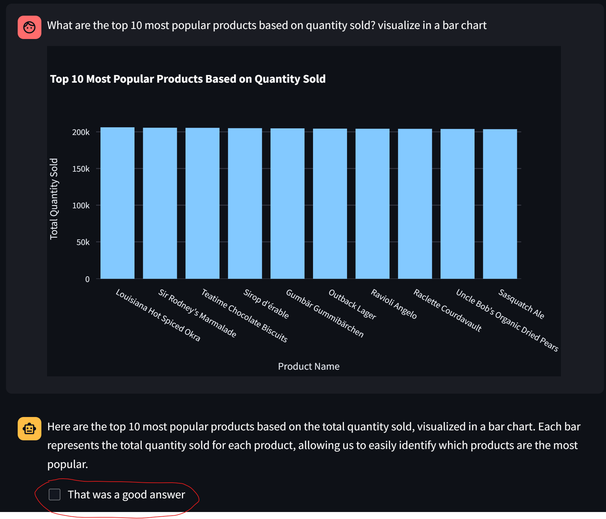

## Overview
This application showcases the concept of a smart analytical agent designed to assist in answering business inquiries by executing advanced data analytics tasks on a business database. The agent is endowed with a learning capability; for problems it has never encountered before, it undergoes comprehensive reasoning steps including researching the database schema and interpreting the definitions of business metrics before proceeding to write code. However, for problems similar to those it has previously solved successfully (in memory recall mode), it quickly leverages its knowledge and reuses the code. The LLM that powers the full reasoning mode is GPT-4o, while the LLM that facilitates the memory recall mode can be GPT-3.5-Turbo.

To determine the quality of the solution or answer to a question, the application provides users with a feedback mechanism. Answers that receive positive feedback are memorized and subsequently utilized by the agent, enhancing its efficiency and accuracy over time.



For a detailed explanation of the concept, visit: [Toward Learning-Capable LLM Agents](https://medium.com/data-science-at-microsoft/toward-learning-capable-llm-agents-72db3737e1c2)

Examples of questions are:
- Simple: 
    - What were the total sales for each year available in the database?
    - Who are the top 5 customers by order volume, and what is the total number of orders for each?
- More difficult: Is that true that top 20% customers generate 80% revenue?
- Advanced: Forecast monthly revenue for next 12 months


## Prerequisites  
### Have following required Azure Services deployment
- Azure OpenAI with GPT-4o and optionally GPT-4o-mini deployments
- Azure AI Search for for Agent's long term memory
- Azure Redis Cache for Agent's current memory and application session state
### Clone the Repository  
    ```sh
    git clone <repository-url>
    cd natural_language_query  
    ``` 
### Setup the secrets.env file content  
The `secrets.env` file should be placed in the root directory and should contain the necessary environment variables. This file is used both locally and in Azure deployments.  
  
Example `secrets.env`:  
  
```env  
# secrets.env  
AZURE_OPENAI_ENDPOINT="https://.openai.azure.com/"
AZURE_OPENAI_API_KEY=""
AZURE_OPENAI_DEPLOYMENT1="gpt-4o"
AZURE_OPENAI_DEPLOYMENT2="gpt-4o-mini"
AZURE_OPENAI_API_VERSION=2024-04-01-preview
AZURE_OPENAI_EMB_DEPLOYMENT=text-embedding-ada-002
AZURE_SEARCH_SERVICE_ENDPOINT=
AZURE_SEARCH_INDEX_NAME=analytic_en
AZURE_SEARCH_ADMIN_KEY=
SEMANTIC_HIT_THRESHOLD=0.02
META_DATA_FILE=../../data/metadata.json
AZURE_REDIS_KEY==
AZURE_REDIS_ENDPOINT=.redis.cache.windows.net
``` 
### Create a virtual environment:  
    ```
    python -m venv venv  
    source venv/bin/activate  # On Windows use `venv\Scripts\activate`  
    ```  
### Install the required packages

    ```pip install -r requirements.txt```  

### Create AI Search Index  
- You need to create an index in AI Search to serve as a long term memory (notebook) for Agent 2 to note down user's approved solutions.
- To do this, follow the steps in Local Run to setup local python environment and run ```create_cache_index.py``` script to setup the index
    ``` 
    python create_cache_index.py  
    ```  

### Local Deployment  
- [Docker](https://www.docker.com/products/docker-desktop)  
- [Docker Compose](https://docs.docker.com/compose/install/)  
- Python 3.8+  
  
### Azure Deployment  
- [Azure CLI](https://docs.microsoft.com/en-us/cli/azure/install-azure-cli)  
  
## Project Structure  
  
```plaintext  
natural_language_query/  
├── src/  
│   ├── agents/  
│   ├── api/  
│   ├── app/  
│   ├── utils/  
│   ├── requirements.txt  
│   └── secrets.env  
├── Dockerfile.python_service  
├── Dockerfile.streamlit_app  
├── docker-compose.yml  
├── deploy_azure.ps1  
├── adeploy_azure.sh
└── README.md  
```
## Installation  
    
### Option: Local Run  
  
  Run the application:  
    ```  
    streamlit run src/app/copilot.py  
    ```  
  
### Option: Deploy to Local Docker Environment  
  
1. Build and Start Containers:  
    ``` 
    docker-compose up --build  
    ```  
2. Access the Applications:  
    - Python service will be available at: [http://localhost:8000](http://localhost:8000)  
    - Main Streamlit app will be available at: [http://localhost:8501](http://localhost:8501)  
  
### Option: Azure Deployment  
  
  
1. Login to Azure:  
    ```
    az login  
    ```  
2. Provision and Deploy:  
    ```  
    ./deploy_azure.sh   
    ```   
    This command will:  
    - Create a new resource group with Azure Container Registry, Container Env resources.  
    - Build and push Docker images to the Azure Container Registry.  
    - Deploy the containerized applications to Azure Container Apps.  
  
3. Access the Applications:  
    - FastAPI service will be available at the URL provided by Azure.  
    - Streamlit app will be available at the URL provided by Azure.  
  

Directory Structure
 

## Troubleshooting  
  
### Local Deployment  
  
- Ensure Docker Desktop is running.  
- Make sure you run the Docker commands with elevated privileges if required on Windows.  
  
### Azure Deployment  
  
- Ensure you are logged in to Azure using `az login`.  
- Check the Azure Portal for any issues with the deployed resources.  

## Contributing
Contributions are welcome! Please open an issue or submit a pull request for any improvements or bug fixes.
## License  
  
This project is licensed under the MIT License.  


